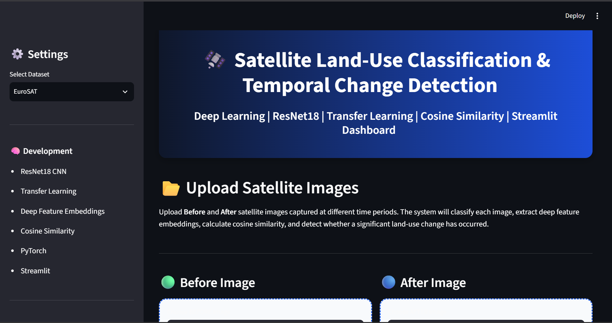
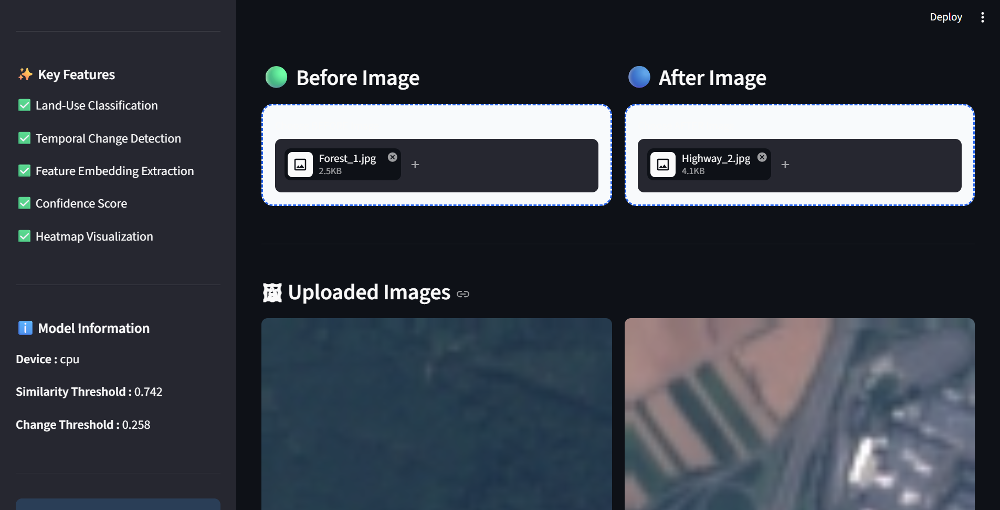
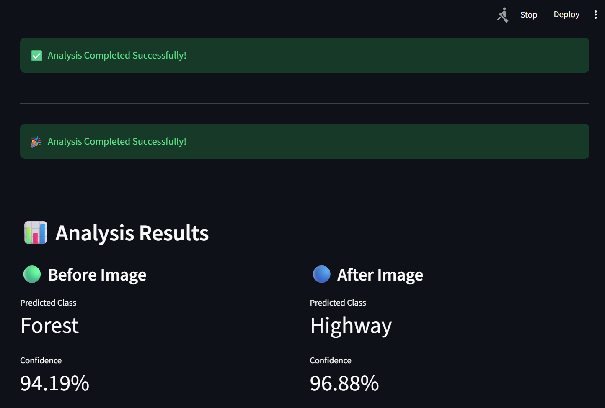
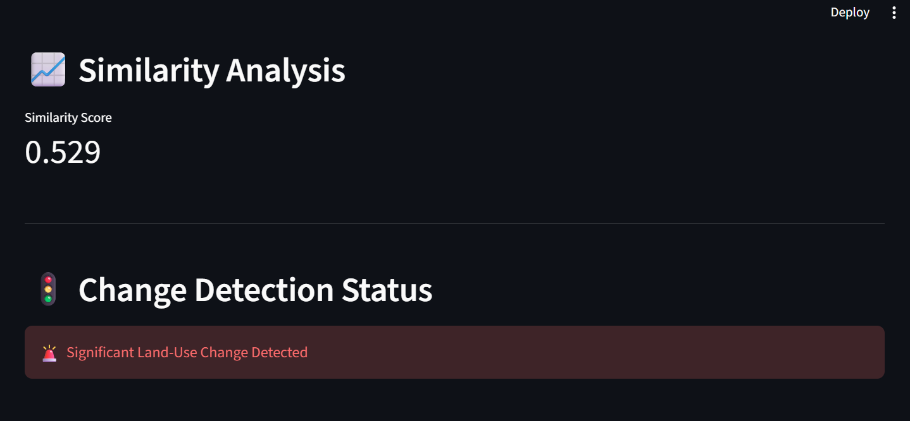
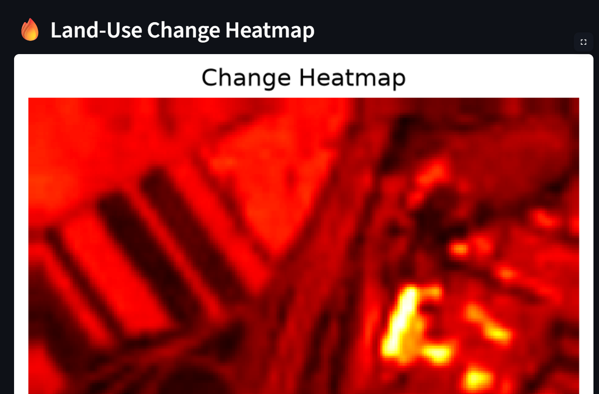
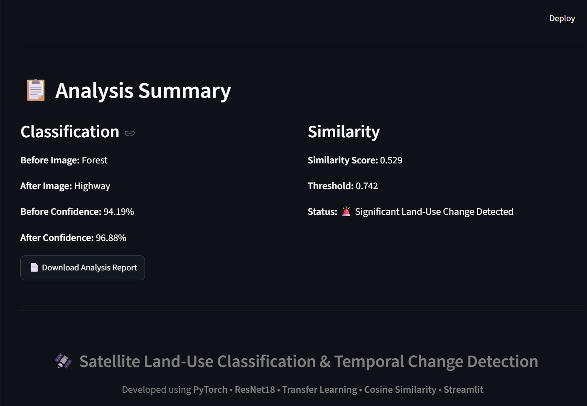

<div align="center">

# 🛰️ Satellite Land-Use Classification & Temporal Change Detection

### Deep Learning • Transfer Learning • Computer Vision • Remote Sensing • Streamlit

<p align="center">


</p>

### 🚀 Intelligent Satellite Image Analysis using ResNet18 & Feature Embeddings

Predict land-use categories from satellite imagery, compare two satellite images captured at different time periods, detect land-use changes using deep feature embeddings and cosine similarity, visualize changes using heatmaps, and generate downloadable analysis reports.

---

### 🌐 Live Demo

> https://satellite-landuse-classifier.streamlit.app

### 🎥 Project Demo

> 🚧 **Coming Soon**  
> https://youtu.be/your-demo-video

</div>

---

# 📑 Table of Contents

- [Project Overview](#-project-overview)
- [Project Objectives](#-project-objectives)
- [Key Features](#-key-features)
- [Project Workflow](#-project-workflow)
- [System Architecture](#-system-architecture)
- [Technology Stack](#-technology-stack)
- [Datasets](#-datasets)
- [Project Structure](#-project-structure)
- [Model Training Pipeline](#-model-training-pipeline)
- [Results](#-results)
- [Dashboard Preview](#-dashboard-preview)
- [Installation Guide](#-installation-guide)
- [Run Locally](#-run-locally)
- [How to Use](#-how-to-use)
- [Future Improvements](#-future-improvements)
- [Acknowledgements](#-acknowledgements)
- [Author](#-author)
- [License](#-license)

---

# 📖 Project Overview

Satellite imagery plays a crucial role in monitoring urban development, agriculture, forests, transportation networks, and environmental changes. Manual inspection of satellite images is both time-consuming and resource-intensive.

This project presents a complete **Deep Learning-based Land-Use Classification and Temporal Change Detection System** capable of automatically classifying satellite images into land-use categories and identifying significant land-cover changes between two different time periods.

The application leverages **Transfer Learning with ResNet18**, deep feature embeddings, cosine similarity, and an interactive **Streamlit Dashboard** to provide accurate predictions and intuitive visualizations.

Unlike traditional image classification systems, this project not only predicts the land-use category but also determines whether meaningful environmental changes have occurred between two satellite images.

---

# 🎯 Project Objectives

The major objectives of this project are:

- 🌍 Classify satellite images into multiple land-use categories
- 🧠 Utilize Transfer Learning for improved classification accuracy
- 📈 Compare two satellite images using deep feature embeddings
- 📊 Measure similarity using Cosine Similarity
- 🔥 Generate heatmaps highlighting changed regions
- 🚨 Detect significant land-use changes automatically
- 📄 Generate downloadable analysis reports
- 💻 Provide an interactive Streamlit dashboard for end users

---

# ✨ Key Features

✅ Land-Use Classification

✅ Transfer Learning using ResNet18

✅ Feature Embedding Extraction (512-dimensional vectors)

✅ Cosine Similarity Based Change Detection

✅ Heatmap Visualization

✅ Confidence Score Prediction

✅ Before vs After Image Comparison

✅ Downloadable Analysis Report

✅ Interactive Streamlit Dashboard

✅ Clean Modular Code Structure

✅ Jupyter Notebook Based Training Pipeline

✅ End-to-End Deep Learning Workflow

---

# 🔄 Project Workflow

```text
                Satellite Images
                       │
                       ▼
             Image Preprocessing
                       │
                       ▼
             Transfer Learning (ResNet18)
                       │
      ┌────────────────┴────────────────┐
      │                                 │
      ▼                                 ▼
Land-Use Classification        Feature Extraction
      │                                 │
      └──────────────┬──────────────────┘
                     ▼
            Cosine Similarity
                     │
                     ▼
          Temporal Change Detection
                     │
                     ▼
            Heatmap Generation
                     │
                     ▼
          Streamlit Interactive Dashboard
```

---

# 🏗️ System Architecture

```text
                EuroSAT Dataset
                        │
                        ▼
                 Image Preprocessing
                        │
                        ▼
              Transfer Learning Model
                 (ResNet18 Backbone)
                        │
      ┌─────────────────┴─────────────────┐
      ▼                                   ▼
Land-Use Prediction               Feature Embeddings
      │                                   │
      └─────────────────┬─────────────────┘
                        ▼
              Cosine Similarity Score
                        │
            Similarity > Threshold ?
                 │                  │
              Yes                  No
                 │                  │
         No Significant      Land-Use Change
              Change             Detected
                        │
                        ▼
                 Heatmap Visualization
                        │
                        ▼
             Downloadable Report + Dashboard
```

---

# 💻 Technology Stack

| Category | Technologies |
|-----------|--------------|
| Programming Language | Python |
| Deep Learning | PyTorch |
| Transfer Learning | ResNet18 |
| Machine Learning | Scikit-Learn |
| Image Processing | OpenCV, Pillow |
| Data Analysis | NumPy, Pandas |
| Visualization | Matplotlib |
| Dashboard | Streamlit |
| Notebook | Jupyter Notebook |
| Version Control | Git & GitHub |

---
# 📂 Datasets

This project uses two publicly available remote sensing datasets for training and evaluation.

## 🌍 EuroSAT Dataset (Training Dataset)

The **EuroSAT** dataset is used for training and validating the land-use classification model.

**Dataset Statistics**

| Property | Value |
|----------|-------|
| Total Images | 27,000 |
| Classes | 10 |
| Image Size | 64 × 64 RGB |
| Source | Sentinel-2 Satellite |

### Land-Use Classes

- Annual Crop
- Forest
- Herbaceous Vegetation
- Highway
- Industrial
- Pasture
- Permanent Crop
- Residential
- River
- Sea/Lake

### Dataset
The dataset is available via [Zenodo](https://zenodo.org/record/7711810#.ZAm3k-zMKEA).

##### Deprecated Hosting
* [EuroSAT Dataset (RGB)](https://madm.dfki.de/files/sentinel/EuroSAT.zip)
* [EuroSAT Dataset (MS)](https://madm.dfki.de/files/sentinel/EuroSATallBands.zip)

---

## 🛰️ UC Merced Land Use Dataset (Holdout Dataset)

The **UC Merced Land Use Dataset** is used to evaluate the generalization capability of the trained model on unseen satellite imagery.

| Property | Value |
|----------|-------|
| Images | 2,100 |
| Classes | 21 |
| Image Size | 256 × 256 |
| Purpose | Holdout Evaluation |

### Dataset
The dataset is available via [Kaggle](https://www.kaggle.com/datasets/abdulhasibuddin/uc-merced-land-use-dataset/data).


---

# 📁 Repository Structure

```
CEI-Data-Science-Final-Project
│
├── app/
│   ├── app.py                     # Main Streamlit application
│   ├── models.py                  # Model loading utilities
│   ├── utils.py                   # Prediction & similarity functions
│   ├── heatmap.py                 # Heatmap generation
│   └── assets/                    # Dashboard images
│
├── dataset/
│   ├── EuroSAT/
│   └── UCMerced/
│
├── models/
│   ├── resnet18_best.pth
│   ├── resnet18_ucmerced_final.pth
│   └── threshold.json
│
├── notebooks/
│   ├── 01_EDA.ipynb
│   ├── 02_Preprocessing.ipynb
│   ├── 03_Baseline_CNN.ipynb
│   ├── 04_Model_Evaluation.ipynb
│   ├── 05_Transfer_Learning_ResNet18.ipynb
│   ├── 06_Feature_Embedding_Extraction.ipynb
│   ├── 06A_Transfer_Learning_UCMerced.ipynb
│   ├── 07_Change_Detection.ipynb
│   ├── 08_UCMerced_Evaluation.ipynb
│   ├── 09_Streamlit_Dashboard.ipynb
│   ├── 10_Spatial_Leakage_Experiment.ipynb
│   ├── 11_Spatial_Leakage_Evaluation.ipynb
│   └── 12_Error_Analysis.ipynb
│
├── outputs/
│   ├── confusion_matrix/
│   ├── roc_curve/
│   ├── heatmaps/
│   ├── reports/
│   └── plots/
│
├── assets/
│   ├── dashboard-home.png
│   ├── upload-page.png
│   ├── prediction-results.png
│   ├── similarity-analysis.png
│   ├── heatmap.png
│   └── summary.png
│
├── README.md
├── requirements.txt
├── LICENSE
└── .gitignore
```

---

# 📚 Notebook Description

Each notebook represents a dedicated stage of the complete machine learning workflow.

| Notebook | Description |
|-----------|-------------|
| 01 | Exploratory Data Analysis (EDA) |
| 02 | Data Preprocessing & Spatial Data Split |
| 03 | Baseline CNN Implementation |
| 04 | Baseline Model Evaluation |
| 05 | Transfer Learning using ResNet18 |
| 06 | Deep Feature Embedding Extraction |
| 06A | UC Merced Transfer Learning Evaluation |
| 07 | Temporal Change Detection using Cosine Similarity |
| 08 | UC Merced Holdout Evaluation |
| 09 | Streamlit Dashboard Development |
| 10 | Spatial Leakage Experiment |
| 11 | Random Split vs Spatial Block Evaluation |
| 12 | Error Analysis & Misclassified Samples |

---

# 🧠 Deep Learning Pipeline

The project follows an end-to-end deep learning workflow.

### Step 1 — Data Preparation

- Dataset loading
- Image preprocessing
- Data augmentation
- Dataset visualization
- Spatial Block Split

---

### Step 2 — Baseline CNN

A custom 3-layer CNN is trained to establish baseline performance.

Outputs:

- Training Loss
- Validation Loss
- Accuracy
- F1 Score

---

### Step 3 — Transfer Learning

The pretrained **ResNet18** backbone is fine-tuned using a two-phase training strategy.

### Phase 1

- Freeze all backbone layers
- Train only classifier head
- 3 Epochs

### Phase 2

- Unfreeze Layer3 & Layer4
- Lower Learning Rate
- Train for 5 additional epochs

This strategy improves feature learning while reducing overfitting.

---

# 🛰️ Feature Embedding Extraction

Instead of using only classification outputs, the trained ResNet18 backbone is also used as a feature extractor.

Each satellite image is represented as a:

> **512-Dimensional Feature Vector**

These embeddings capture high-level semantic information and are later used for temporal similarity analysis.

---

# 🔄 Temporal Change Detection

The change detection module compares two satellite images captured at different time periods.

Pipeline:

```
Before Image
        │
        ▼
ResNet18 Feature Extractor
        │
512-D Embedding
        │
        ▼
Cosine Similarity
        │
Threshold Comparison
        │
        ▼
Change / No Change
        │
        ▼
Heatmap Generation
```

A cosine similarity score below the selected threshold indicates a significant land-use change.

---

# 📊 Evaluation Metrics

The project evaluates model performance using multiple metrics.

### Classification Metrics

- Accuracy
- Precision
- Recall
- F1-Score
- Macro F1
- Confusion Matrix

---

### Change Detection Metrics

- Cosine Similarity
- ROC Curve
- Similarity Threshold
- Change Threshold
- Heatmap Visualization

---

# 📈 Project Modules

The system consists of three major modules.

## 🟢 Module 1 — Land-Use Classification

Predicts the land-use category of satellite imagery using Transfer Learning.

---

## 🔵 Module 2 — Feature Embedding Extraction

Extracts semantic feature vectors from the trained ResNet18 backbone.

---

## 🔴 Module 3 — Temporal Change Detection

Compares embeddings from two different satellite images to detect land-cover changes using cosine similarity and visual heatmaps.

---
# 📸 Dashboard Preview

The application provides an intuitive and interactive Streamlit dashboard for satellite image analysis.

---

## 🏠 Home Page



The landing page introduces the project and provides an overview of the complete land-use classification and temporal change detection pipeline.

---

## 📤 Upload Satellite Images



Users can upload **Before** and **After** satellite images for comparison.

Features:

- 📁 Dual Image Upload
- 🌍 Dataset Selection
- ⚡ Interactive Interface
- 📋 Image Information Display

---

## 🧠 Classification Results



For each uploaded image, the dashboard predicts:

- Land-use Class
- Confidence Score
- Deep Feature Embedding

---

## 📈 Similarity Analysis



The dashboard computes cosine similarity between both feature embeddings.

Outputs include:

- Similarity Score
- Threshold Comparison
- Land-use Change Decision

---

## 🔥 Heatmap Visualization



A visual heatmap highlights regions with significant differences between the two satellite images.

---

## 📋 Analysis Summary



The dashboard summarizes:

- Predicted Classes
- Confidence Scores
- Similarity Score
- Change Detection Status
- Downloadable Report

---

# 📊 Results

## Model Performance

| Model | Dataset | Purpose |
|------|----------|----------|
| Baseline CNN | EuroSAT | Initial Benchmark |
| ResNet18 (Transfer Learning) | EuroSAT | Final Training |
| ResNet18 | UC Merced | Generalization Evaluation |

---

## Project Achievements

✔ Land-Use Classification

✔ Transfer Learning

✔ Frozen vs Unfrozen Comparison

✔ Feature Embedding Extraction

✔ Cosine Similarity Analysis

✔ Temporal Change Detection

✔ Heatmap Generation

✔ Spatial Leakage Experiment

✔ Error Analysis

✔ Interactive Streamlit Dashboard

✔ Downloadable Report Generation

---

# 🚀 Installation Guide

## 1️⃣ Clone the Repository

```bash
git clone https://github.com/Anildas-05/CEI-Data-Science-Final-Project.git
```

```bash
cd CEI-Data-Science-Final-Project
```

---

## 2️⃣ Create a Virtual Environment

### Windows

```bash
python -m venv .venv
```

```bash
.venv\Scripts\activate
```

### Linux / macOS

```bash
python3 -m venv .venv
```

```bash
source .venv/bin/activate
```

---

## 3️⃣ Install Dependencies

```bash
pip install -r requirements.txt
```

---

## 4️⃣ Download the Dataset

Download the datasets and place them inside the project folder.

```
dataset/
    EuroSAT/
    UCMerced/
```

---

## 5️⃣ Run the Streamlit Dashboard

```bash
cd app
```

```bash
streamlit run app.py
```

The application will automatically open in your browser.

---

# 💡 How to Use

### Step 1

Launch the Streamlit application.

---

### Step 2

Select the desired dataset.

---

### Step 3

Upload the **Before** satellite image.

---

### Step 4

Upload the **After** satellite image.

---

### Step 5

Click

```
Analyze Images
```

---

### Step 6

View

- Predicted Land-use Classes
- Confidence Scores
- Similarity Score
- Change Detection Status
- Heatmap Visualization

---

### Step 7

Download the generated analysis report.

---

# 🌐 Live Streamlit Deployment


```
https://satellite-landuse-classifier.streamlit.app
```

---

# 🎥 Project Demonstration

> 🚧 Demo video will be added soon.

```
https://youtu.be/your-demo-video
```

---

# 🎯 Future Improvements

- EfficientNet-B3/B4 Support
- Vision Transformer (ViT)
- Grad-CAM Visualization
- Multi-temporal Satellite Monitoring
- Real-time Satellite APIs
- Cloud Deployment
- Multi-class Change Detection
- GIS Integration
- Automatic Report Generation (PDF)

---

# ❓ Frequently Asked Questions

<details>

<summary><strong>Why ResNet18?</strong></summary>

ResNet18 provides an excellent balance between accuracy, computational efficiency, and transfer learning performance for satellite image classification.

</details>

---

<details>

<summary><strong>Why Cosine Similarity?</strong></summary>

Cosine similarity measures the semantic similarity between deep feature embeddings and is well suited for detecting land-use changes.

</details>

---

<details>

<summary><strong>Can I use my own satellite images?</strong></summary>

Yes. Upload any compatible satellite images using the Streamlit dashboard.

</details>

---

<details>

<summary><strong>Does this work offline?</strong></summary>

Yes. After installing the required dependencies, the dashboard runs locally without an internet connection.

</details>
---

# 👨‍💻 Author

## Anil Kumar Das

Final Year B.Tech Computer Science Engineering Student

- GitHub: https://github.com/Anildas-05
- LinkedIn: www.linkedin.com/in/anilkumardas5

---

# 📜 License

This project is licensed under the MIT License.

---

# ⭐ Support

If you found this project useful:

⭐ Star this repository

🍴 Fork the repository

🐛 Report issues

💡 Suggest improvements

---

<div align="center">

## 🚀 Thank You for Visiting!

If you like this project, don't forget to ⭐ star the repository.

Made with ❤️ using **PyTorch**, **ResNet18**, and **Streamlit**.

</div>
